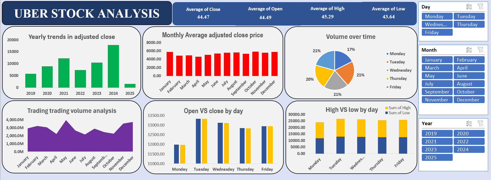

# Uber Stock Analysis (Excel Dashboard & Pivot Tables)

## 📌 Business Problem & Objectives
Evaluating historical equity data is essential for identifying cyclical market trends, assessing liquidity risk, and uncovering long-term growth phases[cite: 3]. This project analyzes Uber’s historical stock market performance to isolate month-over-month pricing trends, track trading volume volatility, and establish data-driven baselines for financial forecasting and investment decision-making[cite: 3].

## 📊 Core Financial KPIs Tracked
* **Monthly Average Adjusted Close Price:** Mapping asset value performance to pinpoint seasonal strength and market correction phases[cite: 3].
* **Temporal Volume Metrics:** Tracking daily, weekly, and monthly trading volume pipelines to measure market liquidity and investor interest shifts[cite: 3].
* **Year-over-Year (YoY) Growth Trends:** Evaluating long-term macro performance indicators to contextualize overall corporate market health[cite: 3].

## 🛠️ Data Infrastructure & Excel Techniques
* **Data Summarization & Aggregation:** Utilized **Pivot Tables** to calculate multi-level summary statistics including Average Open, Close, High, and Low parameters across massive time-series intervals[cite: 3].
* **Feature Engineering & Calculations:** Implemented Calculated Fields to isolate key financial metrics and performance deltas[cite: 3].
* **Interactive Dashboard Architecture:** Designed an executive-level control space utilizing **Pivot Charts** tightly coupled with interconnected dynamic **Slicers (Year, Month, Trading Metrics)** for seamless historical filtering[cite: 3].

---

## 🖥️ Financial Dashboard Preview

---

## 📈 Key Financial Discoveries & Market Insights

### 1. Cyclical & Seasonal Pricing Anomalies
* **The Insight:** Historical data aggregation reveals that certain calendar months consistently generate higher average adjusted close prices, indicating predictable seasonal cycles in market sentiment[cite: 3].

### 2. Weekday Liquidity Fluctuations
* **The Insight:** Granular time-series analysis shows distinct trader behavior patterns, where trading volume peaks heavily between **Monday and Wednesday** across consecutive months, highlighting prime weekly liquidity windows[cite: 3].

### 3. Structural Growth & Macro Phases
* **The Insight:** Multi-year trend lines clearly differentiate progressive capital appreciation windows from localized market correction phases, providing long-term structural context for strategic equity evaluations[cite: 3].
